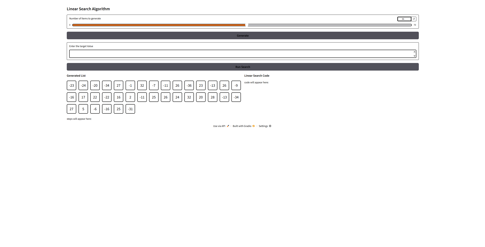
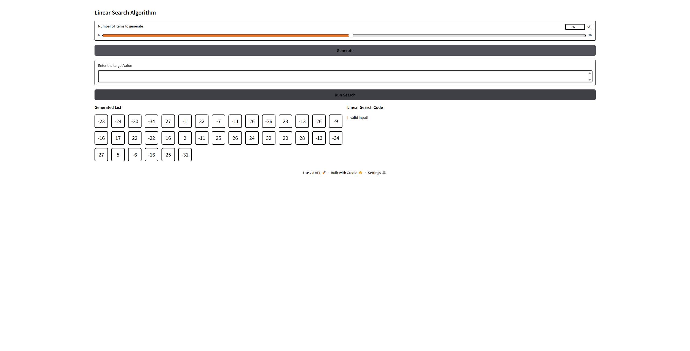
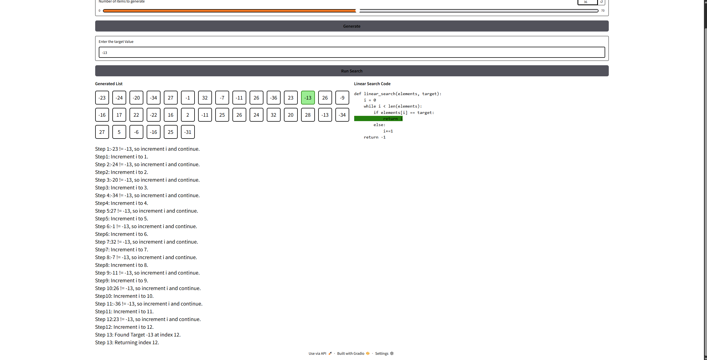
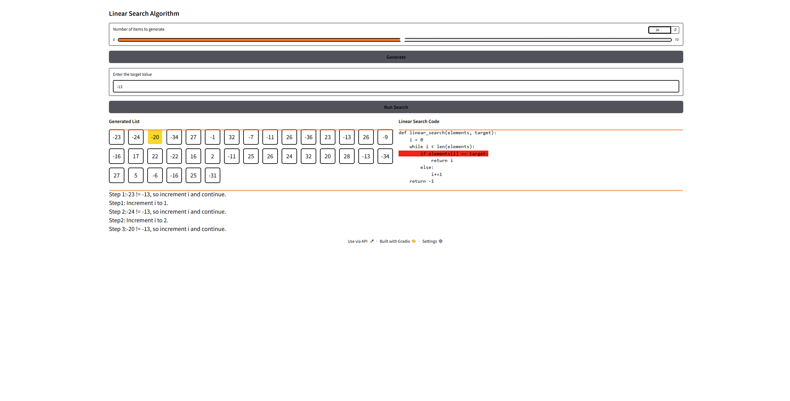
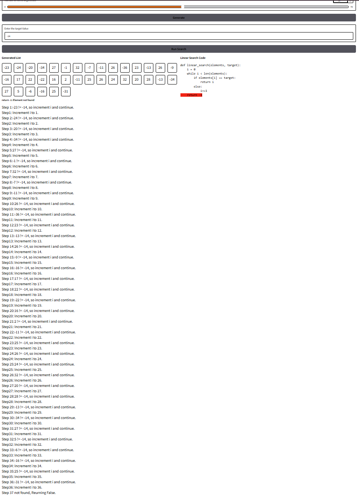
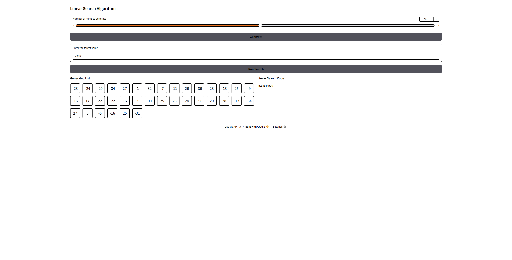
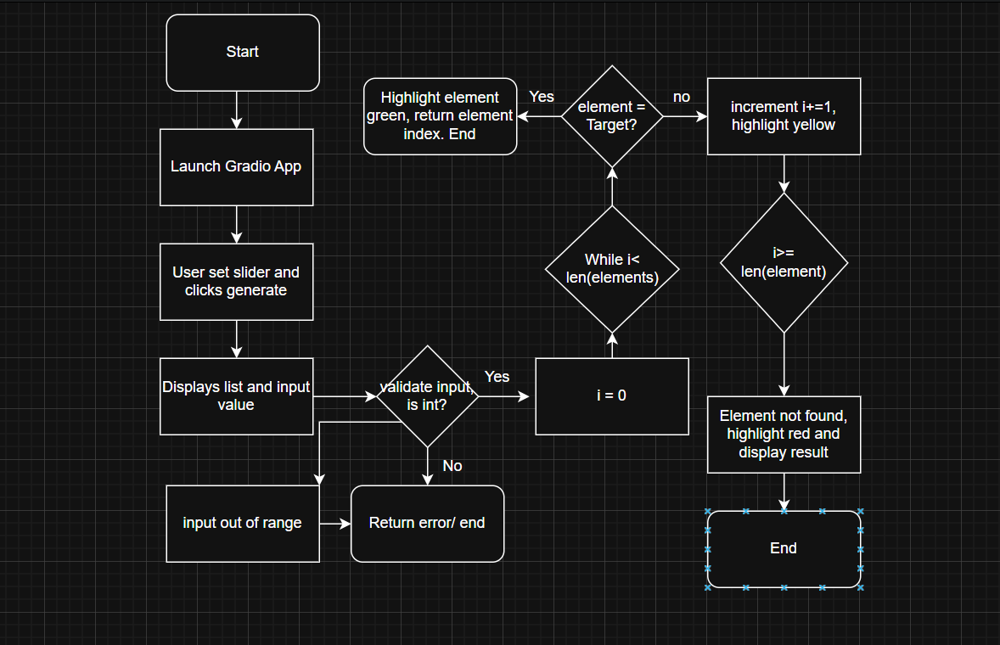

# Algorithm Name
The Algorithm I picked is the Linear Search Algorithm. Thats the name of the project I am going to code. I choose this algorithm because it's the most simplist one out of them all and this link "https://www.cs.usfca.edu/~galles/visualization/Search.html" really gave me inspiration on how to code this. I like the way they used animations to code it and I want to make mines visually appealing similar to what they demenstrated in that link. 
## Demo video/gif/screenshot of test

Elements successfully generated into desire location.

Linear Search only runs if a target value is given, else displays "invalid input!"

Performs Linear Search correctly, when element found: Steps are paste right under

Highlight elements performs the job correctly when element is not found.

Return False, and highlight return -1 when element is not found in our linear Search

Handles invalid inputs;

Handles edge cases.
Video:
<video width="480" controls>
    <source src ="Assets/Vid1.mp4" type="video/mp4">
</video>
[Click here to watch video](Assets/Vid1.mp4)

## Problem Breakdown & Computational Thinking (You can add a flowchart and write the)
1. Decompostion:
Breaking the problem into smaller steps, in order to implement a linear search function with visually appealing effects, we need to implement buttons, some kind of organization with the textboxes and elements.
- I will code a generate element function
- Display them with some kind of animation
- Display the "linear code beside it" to have a side by side comparsion on whats happening with the code and our actual elements
- perform linear search correctly
- Show the steps in a manner so that its like were teaching students
- Check for edge cases, test and enhance
2. Abstraction
Focusing on main important details of the code, ignoring irrelevant ones.
- We need to focus on the animation part of the assignment as it will be the most complex
- The idea will be to use color/highlights to visually display whats going on with the code along side with the steps shown
- We will need a random number generator to generate random elements
- highlighting code lines into visual cues, like yellow = checking, green means correct and red means incorrect
3. Pattern Recognition
- The highlighting process will repeat the same step, yellow will appear over and over again as linear search algorithm checks from the beginning until the element is found.
- The animation will show repeated behavioirs of incrementing the index when checking elements.
4. Design/Algorithmic Thinking
- The linear search is going to be structured in condtional logic, has to be able to check user input, handle if element is found, currently checking and if not found. 
- The gradio should be seperated into seperate sections, like using rows and collumns to organzie element correctly
- Randomly generated elements should be displays in an organzied manner as well as be able to perform the linear search
- We can use some kind of HTML and Css implementation to enhance visual display. Watch video for more info. 
Flowchart:

## Steps to Run
The steps are very easy to run, when entering the webpage. Please select an element to generate with the slider, eneter target value and select search button. All the elements, steps and displays will be highlighted and shown with resepect to the current steps. Refer to the video for an more close up view.
## Hugging Face Link
## Author & Acknowledgment
The code has some parts influenced by AI, especailly the css and html parts, where I asked CHATGPT to help me generate and how to code. ChatGPT also helped explain a lot of concepts as well as defintions and errors fixing. I implemented comments beside codes that were AI influenced. 
Resources used (links):
https://www.gradio.app/ #visited this website for most of the info
https://www.gradio.app/guides/controlling-layout
https://www.gradio.app/docs/gradio/column
https://www.gradio.app/guides/the-interface-class
https://www.gradio.app/docs/gradio/row
https://www.youtube.com/watch?v=mB68GanHJj4&list=PLMi6KgK4_mk3DH0Mze62_wyxEmg4R9dF9
https://www.youtube.com/watch?v=u46nNK4lmeE
https://dev.to/0xkoji/use-css-with-gradio-4c6j
https://www.geeksforgeeks.org/python/sleep-in-python/

overall, the code is mainly coded by me, with the defintion and concepts coming from CHATGPT help. The chat prompt is listed below; 
https://chatgpt.com/share/6929125e-4554-8007-b0c6-3d0834141f1a

